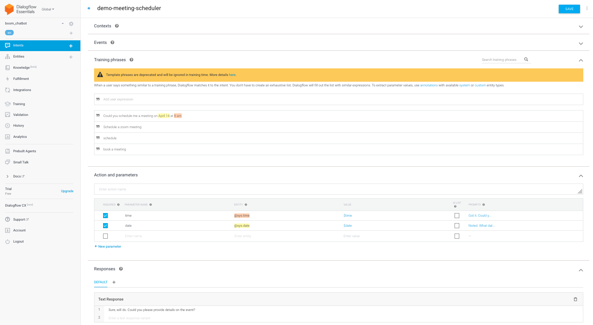
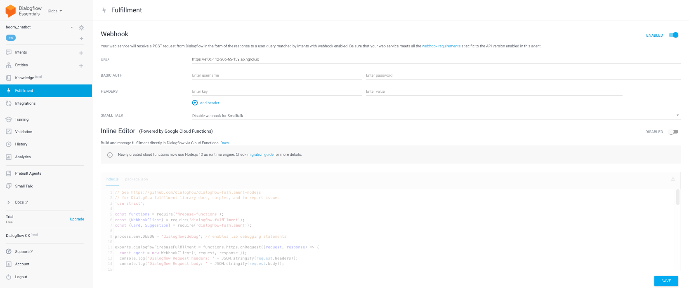
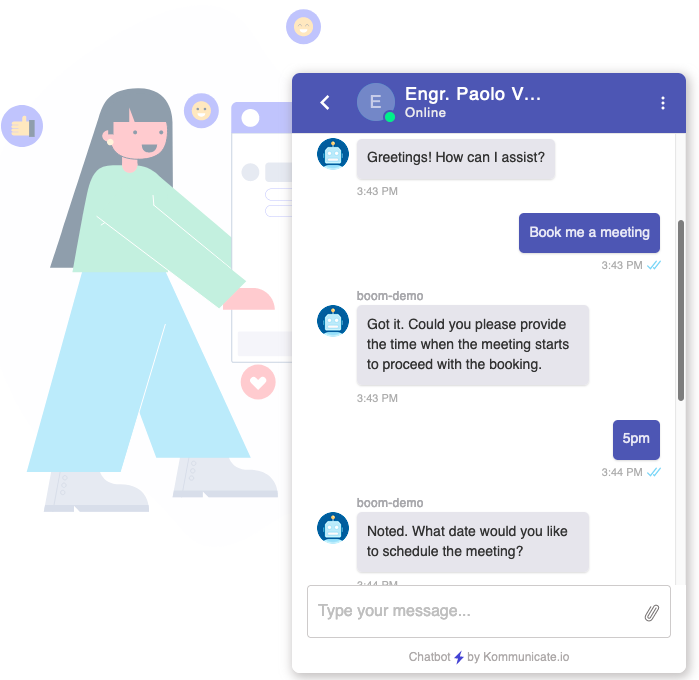
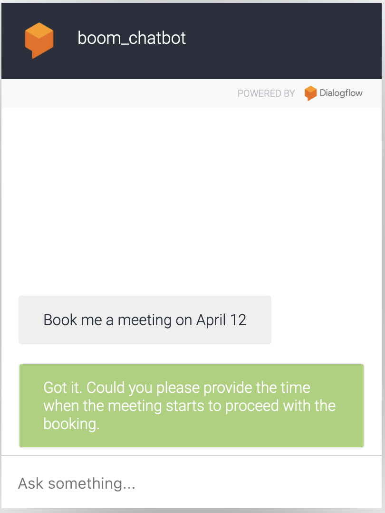

# boom


Repo for text and audio-related experiments

---
## Task 1: Text
The folder `1_text` contains a Jupyter Notebook on experiments for text classification. It is meant to be run on JupyterLab.

Step 1: Create a pipenv
```
pip install virtualenv
virtualenv boom_venv
source boom_venv/bin/activate
```

Step 2: Install JupyterLab via pip:
```
pip install jupyterlab
```

Step 3: Once installed, launch JupyterLab using this command:
```
jupyter-lab
```

Step 4: Once open, it will automatically direct you to a jupyter server. From there, you can now open the notebook found in `1_text>01Text_Classification_on_GLUE_pfvaldez.ipynb`

---
## Task 2 Audio

The folder `2_audio` contains a Jupyter Notebook on experiments for text classification. It is meant to be run on Google Colab.

Step 1: Create a pipenv
```
pip install virtualenv
virtualenv boom_venv
source boom_venv/bin/activate
```

Step 2: Install JupyterLab via pip:
```
pip install jupyterlab
```

Step 3: Once installed, launch JupyterLab using this command:
```
jupyter-lab
```

Step 4: Once open, it will automatically direct you to a jupyter server. From there, you can now open the notebook found in `2_audio>02Audio_Classification_pfvaldez.ipynb`

---
## Task 3 Q&A

The folder `3_QA` contains subdirectory of all related files on experiments for Question and Answer model. 
It is meant to be run on local environment, preferably MacOS.
Following the instructions from [Build a Q&A App with PyTorch](https://towardsdatascience.com/build-a-q-a-app-with-pytorch-cb599480e29)

We first build the Q&A model 

Step 1: Create a pipenv
```
pip install virtualenv
virtualenv boom_venv
source boom_venv/bin/activate
```

Step 2: Download Stanford Question Answering Dataset 2.0

```
cd ./3_QA
wget https://rajpurkar.github.io/SQuAD-explorer/dataset/train-v2.0.json
```

Step 3: Download the Huggingface model using Bash script file `download_model.sh`

```
chmod +x download_model.sh
./download_model.sh
```

Step 4: Install Docker, follow instructions from the official site for:
-  [Mac](https://docs.docker.com/desktop/install/mac-install/) 
- [Windows](https://docs.docker.com/desktop/install/windows-install/)
- [Linux](https://docs.docker.com/desktop/install/linux-install/)

Step 5: After installing Docker. Run the notebook `test_app.ipynb'

---
## Task 4 Speech

In this experiment, I created a web app for live text-to-speech transcription. 

The demo video, showing live transcription using my microphone can be found [here](https://youtu.be/Tce65iStH2c).

Instructions for running the experiment:

Step 1: Sign up for Deepgram account and get an API key. Save your API key to a `.env` file, make sure to include the `.env` file in your `.gitignore` file.
It should look something like this:
```
DEEPGRAM_API_KEY= "*****************************************************d"
```


Step 2: Create a virtual environment, if you have not done so.
```
python3 -m venv boom_venv
source boom_venv/bin/activate
```

Step 3: Install FastAPI, Deepgram Python SDK

```
pip install "fastapi[all]"
pip install deepgram-sdk
```


Step 4: In case you encounter a error related to WebSocket, to resolve this I did the following:

    - If you are using Mac follow this suggestion in the [StackOverflow thread](https://stackoverflow.com/a/58525755).

    - I followed the suggestion in this [GitHub Issue Comment](https://github.com/websockets/ws/issues/1537#issuecomment-476498391), wherein you have to change the URL to your local machines' WebSocket server. This is line 18 of `4_speech/templates/index.html`. 

Step 5: To run the web app, execute the following in your respective terminal:

```
cd 4_speech
uvicorn main:app --reload
```

---
##  Task 5 Chat
In this experiment, I created a chatbot. To run this, make sure you have a Diagflow account and Kommunicate account.

To repproduce the chatbot, do the following:

Step 1: Register for an account at the following
- [ngrok](https://ngrok.com/)
- [diagflow](https://cloud.google.com/dialogflow)
- [kommunicate](https://www.kommunicate.io/)

For a custom chatbot you need to create intents, see the image below for reference.



Step 2: Paste your ngrok auth token in a `.env` file. It should resemble something like :

```
NGROK_AUTH_TOKEN="**********************************************************************h"
```
For security reasons, make sure to include in your `.gitignore` the `.env` file.


Step 3: Next, run the flask app.
```
cd 5_chat
python app.py
```


Step 4: We need a public URL for a webhook to our diagflow where our chatbot model is trained. Run ngrok using this terminal command.
```
ngrok http 8000
```

Step 5: Copy the ngrok url and paste it on the diaglow dashboard under the `Fullfillment` tab.
Refer to the image below.




Step 6: To view the chatbot deployed at kommunicate visit this [link](https://www.kommunicate.io/livechat-demo?appId=77c7e2f192e5ef67acb969f0a435407d&botIds=boom-demo-7lrhr&assignee=boom-demo-7lrhr).

4. Create a service account, and get the private key for your chatbot.

5. Add the private key to your kommunicate account. Log-in to your `kommunicate.io` account and on the side panel click the robot logo that states `bot integration` upon hovering your mouse. From here, you will be able to host your diagflow to a working chatbot simillar to the image below.




Kommunicate will host your chatbot and provide a demolink simillar to this one.
`https://www.kommunicate.io/livechat-demo?appId=77c7e2f192e5ef67acb969f0a435407d&botIds=boom-demo-7lrhr&assignee=boom-demo-7lrhr`

The chatbot can also be hosted on GCP, accessible using this [link](https://bot.dialogflow.com/51c2f02f-4b82-4b72-bcb0-6bce48a89974) for a limited time only. Sample screenshot below.

